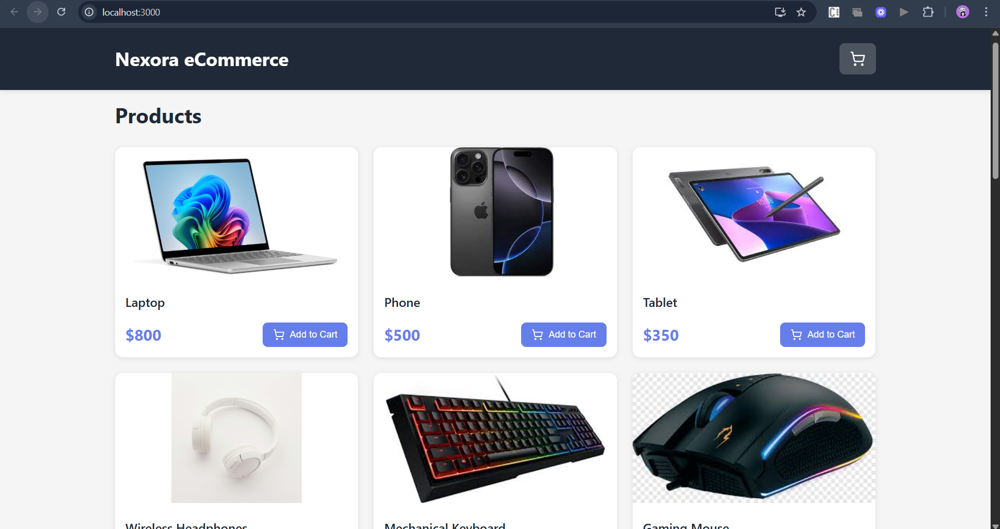
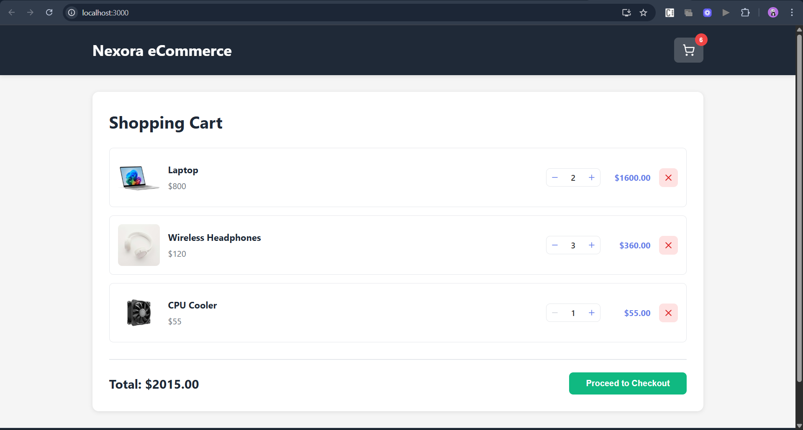
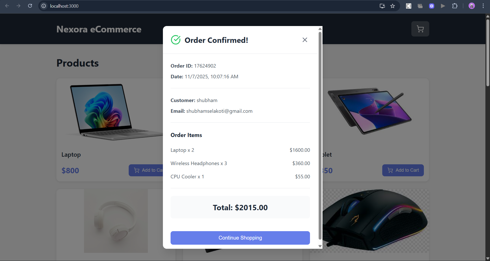

# 🛍️ Nexora E-Commerce Website

A simple full-stack **E-Commerce web application** built using **React.js**, **Node.js**, **Express.js**, and **MongoDB**.  
It demonstrates a basic **add-to-cart** and **checkout** workflow using a **dummy API**.

---

## 📂 Project Structure

```
.
├── my-app/          # Frontend (React)
├── server/          # Backend (Node.js + Express)
└── screenshots/     # Project screenshots (3 images)
```

---

## 🚀 Features

- 🛒 Add to Cart & Checkout functionality  
- ⚙️ Dummy API integration for seamless testing  
- 💾 MongoDB queries for product and cart data  
- 🎨 Modern UI with CSS and **Lucide-React** icons  
- ⚡ Full-stack setup with separate client and server folders

---

## 🖥️ Screenshots

Below are some snapshots from the working project (found in the `/screenshots` folder):

| Homepage | Cart | Checkout |
|-----------|------|-----------|
|  |  |  |

---

## 🧩 Tech Stack

**Frontend:** React.js, CSS, Lucide-React  
**Backend:** Node.js, Express.js  
**Database:** MongoDB  

---

## ⚙️ Installation & Setup

### 1️⃣ Clone the Repository
```bash
git clone https://github.com/shubhamselakoti/eCommerce-Project.git
cd nexora-ecommerce
```

### 2️⃣ Start the Backend Server
```bash
cd server
npm install
node index.js
```

### 3️⃣ Start the Frontend App
Open a new terminal:
```bash
cd my-app
npm install
npm start
```

---

## 🧠 How It Works

- The **frontend (my-app)** interacts with a **dummy API** to perform add-to-cart and checkout actions.  
- The **backend (server)** handles requests using **Express.js** and communicates with MongoDB for data persistence.  
- The app demonstrates a realistic e-commerce flow in a simple and lightweight manner.

---

## 🪄 Future Enhancements

- Integrate real product APIs  
- Add user authentication  
- Implement payment gateway simulation  
- Improve responsive design and animations

---

## 👨‍💻 Author

**Nexora E-Commerce Website**  
Developed by *Shubham Selakoti*

---

## 📝 License

This project is open-source and available under the [MIT License](LICENSE).
